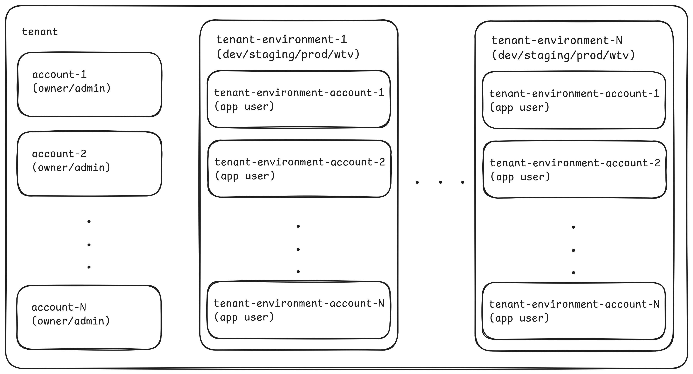
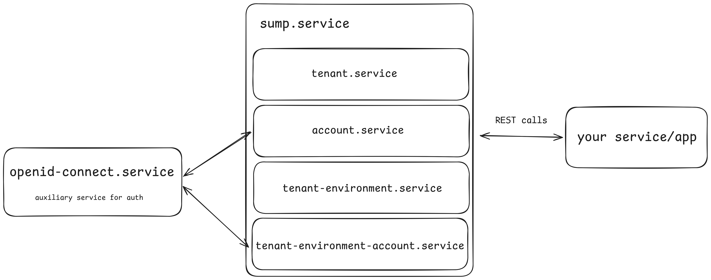
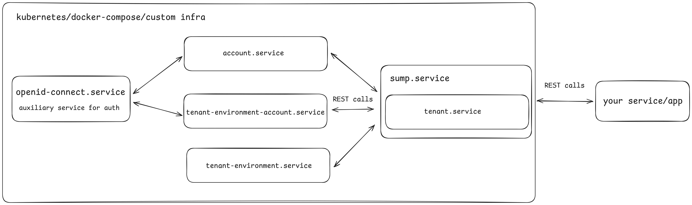
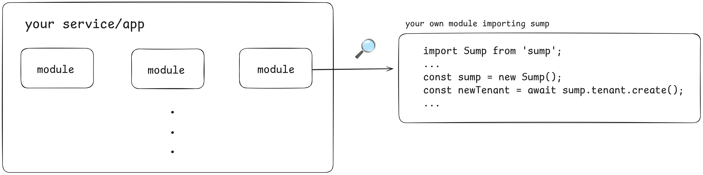

# sump - simple user management platform

> [!CAUTION]
> This is still *very* WIP

A definition from [dictonary.com](https://www.dictionary.com/browse/sump):
> _"sump: a pit, well, or the like in which water or other liquid is collected."_

But this collects *user accounts* to recirculate (auth).

### The idea and requirements

TL;DR: a personal project made as a study on the [SAGA pattern](https://microservices.io/patterns/data/saga.html) and making a program that can be used as either an imported npm package, a standalone monolith or some microservices. I'm not using frameworks or ORM/ODM.

#### My intent with this project

This is a proof of concept. Some of the features might not be needed at all, and I made some parts of it more complicated that they needed to be as a way to test stuff.

With that out of the way, here's what drives the development of it:

- make something that can plugged in any environment (imported as a npm dependency, started as a RESTful monolith service or have the internal services working as microservices),
- study the [SAGA pattern](https://microservices.io/patterns/data/saga.html),
- have something to manage users for my _other projects_ that don't require me to subscribe to a third party when I don't have the need/want ($$) for a managed service.

#### The desire to `stay lightweight` dependency wise

I want to keep this project lightweight, so **I’m avoiding frameworks** or tools that add unnecessary overhead to the app’s resources (for example, using an ORM like Prisma or Sequelize for database access, or Nest to wrap the whole thing). What I have here are just plain typescript modules/files, with no unknown magic underneath.

Here's the main dependencies and their roles:

- [knex.js](https://knexjs.org) + [pg](https://www.npmjs.com/package/pg) to connect to Postgres,
- [express](https://expressjs.com/) and some convenience middlewares for exposing the application as a RESTful API,
- [pino](https://getpino.io) for logging.

The project structure is just something I made that allows me to easilly add new modules/whole services when needed. Also, all the big parts work with **dependency injection** for ease of testing, maintainability and all that good stuff.

### How it works (or at least should work)

##### The "moving parts"

There are 4 main components in this system:

- `tenant` - the main container that groups all the other components (like an `organization` in other platforms);
- `account` - **exclusively for tenant management**, it can (depending on the permissions) act on the other components and the whole tenant itself;
- `tenant-environment` - a sub container inside the tenant. This is where the actual users of whatever application this is plugged into will resider (eg. `dev`, `staging`, `prod` environments);
- `tenant-environment-account` - this is your application's user. It lives inside an environment from the tenant. This is *different* from the `account` model.

Together they look like this:



- A tenant can have multiple accounts for management purposes;
- A tenant can have multiple environments;
- An environment can have multiple accounts (the actual app user).

The typical use for a identity/user management platform, and what `sump` is itendend to facilitate, is the following:

- you setup your `tenant` (give it a name and some settings) and your root account (with the `owner` role),
- create a new `tenant-environment` (also give it a name and settings), 
- start creating users (`tenant-environment-account`) in the new environment and authenticating them when needed.


##### Sump as a restful service monolith

You can start the service by having a config file to set the service up running `npm start`. 



##### Sump as microservices

Theres a docker-compose file that describes how to make each internal service o sump work as a standalone service that the main service can communicate with via REST. You could, for instance, make just one of the internal services work in the same node process as the main service (eg. it has low usage) and the rest be spawned as RESTful services. This can be done via the config file.

It would look like this:



Each internal service has ways to communicate with the main service through rest calls

##### Sump as a npm dependency

You import sump and create a new instance of the service by passing the appropriate config options



Depending on the configuration you passed to the instance, you could also use some of the internal services as microservices (eg. having the `tenant-environment-account.service` as a REST service while the others remain in the same node process).

##### The services

###### main service

This is the entrypoint of the whole service. it holds most of the business logic (some are inside the other services) related to interacting with `sump`.

@TODO: describe the business/main service, local api and rest api

###### tenant service

Allows a client to create and manage a tenant.

@TODO: describe the tenant service, local api and rest api

###### account service

Allows a client to create and manage users that have administrative roles in the tenant.

@TODO: describe the account service, local api and rest api

###### tenant environment service

Manages the environment your app will use to hold your users.

@TODO: describe the tenant-environment service, local api and rest api

###### tenant environment account service

Manages the users of your app.

@TODO: describe the tenant-environment-account service, local api and rest api

##### OpenID Provider 

@TODO: describe the usage of [node-oidc-provider](https://github.com/panva/node-oidc-provider) as the way to do user auth 

##### Config options and file (sump-config.json)

@TODO: describe the configs sump supports

### Installation and Deployment 

##### As a npm module

Install
```sh
npm install sump
```

Importing it

```javascript
const Sump = require('sump');
// or
import Sump from 'sump';


// setup your configs
const sumpConfigs = {};
// creating a service instance
const sump = new Sump(sumpConfigs);

sump.<whatever>();
```


##### Using it as a standalone monolith service

To start it as a service you have options.

###### Using the `listen` method from the sump instance

This can give more flexibility on what your user management service do, like if you have some bootstraping to do prior starting the service or what not.
You can do the same thing as when you use it as a module, just by passing the correct configs (like port) and start it just like a express server:

```javascript

// setup your configs
const sumpConfigs = {};
// creating a service instance
const sump = new Sump(sumpConfigs);

sump.listen();
// or
sump.listen((port) => console.log(`server running! http://localhost:${port}`));
```

###### Using a docker image 

```sh
 # build the image locally from the repository
 docker buildx build \
    --build-context project=https://github.com/thassiov/sump.git \
    -t my_username_or_organization/sump_or_whatever:1.0 .

 # run a container from the built image, providing a config file (sump-config.json) and exposing the application port (8080) to the host
 docker run \
 --name sump-service \
 -p 8080:8080 \
 --read-only -v /<path_to_your_config_file>/sump-config.json:/app/sump-config.json
 -d my_username_or_organization/sump_or_whatever:1.0
```

### How to use it

@TODO: describe instance methods
@TODO: describe REST api

### Development

The only dependency you'll need to work on this project is have docker installed.
There is a `Dockerfile` to build the image of the service and a `docker-compose.yaml` file that builds the necessary services to make it all run.

Currently the services are (listed inside the docker-compose file):

- posgres-local: just a instance of postgres to make the project work;
- base-image: builds the image to be used by the other services;
- posgres-init: using the built image, runs the migrations to build tables and setup whatever else is needed in the db;
- *main-service*: using the built image, starts the service exposing the port 8080 at the localhost.

To run services *with hot reload* of changed files, use the following command:

```bash
docker compose up --watch --build
```

The `--watch` flag uses the `develop` block inside the main-service to know what to look for.

- changes inside `./src` triggers a service restart
- changes in the `package.json` file rebuild the image of the service

### Roadmap (no guarantees it will be followed, though. but at least this is something)

@TODO: write the roadmap

### License
[MIT](./LICENSE), of course.
