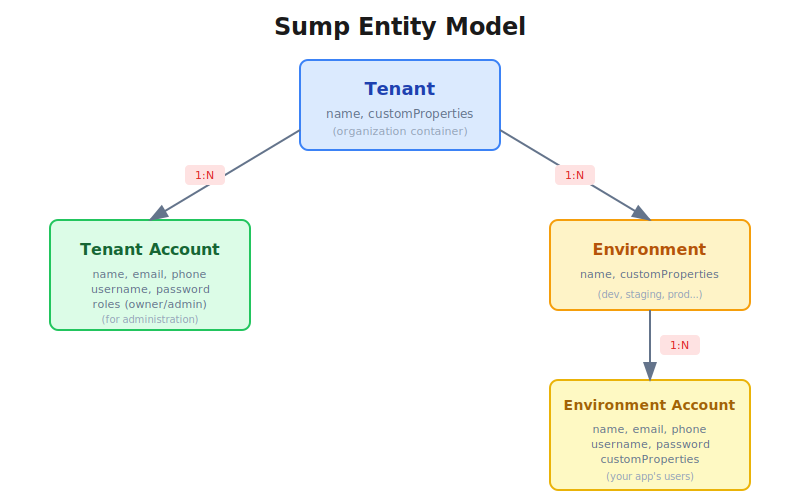

# sump - simple user management platform

[](https://github.com/thassiov/sump/actions/workflows/ci.yml)
[](https://opensource.org/licenses/MIT)

> [!CAUTION]
> This is still *very* WIP

A definition from [dictionary.com](https://www.dictionary.com/browse/sump):
> _"sump: a pit, well, or the like in which water or other liquid is collected."_

But this collects *user accounts* to recirculate (auth).

## Overview

Sump is a multi-tenant user management platform that provides:

- **Multi-tenancy**: Create isolated tenants with their own accounts and environments
- **Environments**: Separate user pools within a tenant (e.g., dev, staging, production)
- **Authentication**: Built-in auth with password hashing (bcrypt), session management (signed cookies), and password reset flows
- **Authorization**: Role-based access control (owner, admin, user)
- **Custom Properties**: Flexible key-value metadata on tenants, environments, and accounts

## Entity Model



- **Tenant**: The main container (like an organization). Has a name and custom properties.
- **Tenant Account**: Administrative accounts for managing the tenant (owner, admin roles).
- **Environment**: Sub-containers within a tenant (e.g., dev, staging, prod).
- **Environment Account**: Your application's end users, living within an environment.

## Dependencies

- Node.js (>= v20)
- PostgreSQL (>= v13)
- Docker (>= 28.x) [optional, for containerized deployment]

## Installation

```sh
# Clone the repo and install dependencies
git clone https://github.com/thassiov/sump.git
cd sump
npm install
```

## Running the server

```sh
# Set required environment variables
export AUTH_SECRET="your-32-character-secret-key-here"
export DB_HOST="localhost"
export DB_PORT="5432"
export DB_USER="postgres"
export DB_PASSWORD="your-password"
export DB_NAME="sump"

# Run database migrations
npm run db:migration:up

# Start the development server
npm run dev:start
```

### Using Docker Compose

```sh
# Start with docker compose (includes PostgreSQL)
npm run dev:container:start

# Or with hot-reload
npm run dev:container:watch
```

## Quick Start

### 1. Create a tenant

First, create a tenant with an owner account. This will also create a default environment.

```sh
curl --location 'http://localhost:8080/api/v1/tenants' \
--header 'Content-Type: application/json' \
--data-raw '{
    "tenant": {
        "name": "my first tenant",
        "customProperties": {
            "app": "my-app"
        }
    },
    "account": {
        "name": "My Name",
        "email": "my-email@example.com",
        "phone": "+0000000000000",
        "username": "myusername",
        "password": "SecureP@ssw0rd!"
    },
    "environment": {
        "name": "dev"
    }
}'
```

Response (HTTP 201):
```json
{
   "tenantId": "UUID",
   "accountId": "UUID",
   "environmentId": "UUID",
   "session": {
       "id": "UUID",
       "accountType": "tenant_account",
       "accountId": "UUID",
       "contextType": "tenant",
       "contextId": "UUID",
       "expiresAt": "2025-01-27T12:00:00.000Z"
   }
}
```

### 2. Sign up users to an environment

Users can self-register to an environment:

```sh
curl --location 'http://localhost:8080/api/v1/auth/environments/<environmentId>/signup' \
--header 'Content-Type: application/json' \
--data-raw '{
    "name": "John Doe",
    "email": "john@example.com",
    "username": "johndoe",
    "password": "SecureP@ssw0rd!"
}'
```

### 3. Authenticate users

```sh
curl --location 'http://localhost:8080/api/v1/auth/environments/<environmentId>/login' \
--header 'Content-Type: application/json' \
--data '{
    "email": "john@example.com",
    "password": "SecureP@ssw0rd!"
}'
```

## API Endpoints

### Authentication

| Method | Endpoint | Description |
|--------|----------|-------------|
| POST | `/api/v1/auth/tenants/:tenantId/login` | Tenant account login |
| POST | `/api/v1/auth/tenants/:tenantId/logout` | Tenant account logout |
| GET | `/api/v1/auth/tenants/:tenantId/session` | Get current session |
| GET | `/api/v1/auth/tenants/:tenantId/sessions` | List all sessions |
| POST | `/api/v1/auth/tenants/:tenantId/logout-all` | Revoke all sessions |
| POST | `/api/v1/auth/tenants/:tenantId/forgot-password` | Request password reset |
| POST | `/api/v1/auth/tenants/:tenantId/reset-password` | Reset password with token |
| POST | `/api/v1/auth/environments/:envId/signup` | Environment account signup |
| POST | `/api/v1/auth/environments/:envId/login` | Environment account login |
| POST | `/api/v1/auth/environments/:envId/logout` | Environment account logout |
| GET | `/api/v1/auth/environments/:envId/session` | Get current session |
| GET | `/api/v1/auth/environments/:envId/sessions` | List all sessions |
| POST | `/api/v1/auth/environments/:envId/logout-all` | Revoke all sessions |
| POST | `/api/v1/auth/environments/:envId/forgot-password` | Request password reset |
| POST | `/api/v1/auth/environments/:envId/reset-password` | Reset password with token |

### Tenants

| Method | Endpoint | Description |
|--------|----------|-------------|
| POST | `/api/v1/tenants` | Create tenant with owner account |
| GET | `/api/v1/tenants/:tenantId` | Get tenant by ID |
| PATCH | `/api/v1/tenants/:tenantId` | Update tenant |
| DELETE | `/api/v1/tenants/:tenantId` | Delete tenant |
| PATCH | `/api/v1/tenants/:tenantId/custom-property` | Set custom property |
| DELETE | `/api/v1/tenants/:tenantId/custom-property` | Delete custom property |

### Tenant Accounts

| Method | Endpoint | Description |
|--------|----------|-------------|
| GET | `/api/v1/tenants/:tenantId/accounts` | List all accounts |
| POST | `/api/v1/tenants/:tenantId/accounts` | Create account |
| GET | `/api/v1/tenants/:tenantId/accounts/:accountId` | Get account by ID |
| PATCH | `/api/v1/tenants/:tenantId/accounts/:accountId` | Update account |
| DELETE | `/api/v1/tenants/:tenantId/accounts/:accountId` | Delete account |
| PATCH | `/api/v1/tenants/:tenantId/accounts/:accountId/email` | Update email |
| PATCH | `/api/v1/tenants/:tenantId/accounts/:accountId/phone` | Update phone |
| PATCH | `/api/v1/tenants/:tenantId/accounts/:accountId/username` | Update username |
| PATCH | `/api/v1/tenants/:tenantId/accounts/:accountId/disable` | Disable account |
| PATCH | `/api/v1/tenants/:tenantId/accounts/:accountId/enable` | Enable account |

### Environments

| Method | Endpoint | Description |
|--------|----------|-------------|
| POST | `/api/v1/tenants/:tenantId/environments` | Create environment |
| GET | `/api/v1/tenants/:tenantId/environments/:envId` | Get environment |
| PATCH | `/api/v1/tenants/:tenantId/environments/:envId` | Update environment |
| DELETE | `/api/v1/tenants/:tenantId/environments/:envId` | Delete environment |
| PATCH | `/api/v1/tenants/:tenantId/environments/:envId/custom-property` | Set custom property |
| DELETE | `/api/v1/tenants/:tenantId/environments/:envId/custom-property` | Delete custom property |

### Environment Accounts

| Method | Endpoint | Description |
|--------|----------|-------------|
| POST | `/api/v1/environments/:envId/accounts` | Create account |
| GET | `/api/v1/environments/:envId/accounts/:accountId` | Get account |
| PATCH | `/api/v1/environments/:envId/accounts/:accountId` | Update account |
| DELETE | `/api/v1/environments/:envId/accounts/:accountId` | Delete account |
| PATCH | `/api/v1/environments/:envId/accounts/:accountId/email` | Update email |
| PATCH | `/api/v1/environments/:envId/accounts/:accountId/phone` | Update phone |
| PATCH | `/api/v1/environments/:envId/accounts/:accountId/username` | Update username |
| PATCH | `/api/v1/environments/:envId/accounts/:accountId/custom-property` | Set custom property |
| DELETE | `/api/v1/environments/:envId/accounts/:accountId/custom-property` | Delete custom property |
| PATCH | `/api/v1/environments/:envId/accounts/:accountId/disable` | Disable account |
| PATCH | `/api/v1/environments/:envId/accounts/:accountId/enable` | Enable account |

### Health

| Method | Endpoint | Description |
|--------|----------|-------------|
| GET | `/api/v1/health` | Health check |

## Testing

```sh
# Run unit tests
npm run test:unit

# Run integration tests (requires Docker)
npm run test:integration

# Run linting
npm run lint
```

## Related Projects

- [sump-ui](https://github.com/thassiov/sump-ui) - Admin dashboard for managing tenants and environments

## Reference

- [OpenAPI Specification](./openapi.yaml)
- [Architecture details](./docs/img/readme.md)

## License

[MIT](./LICENSE)
